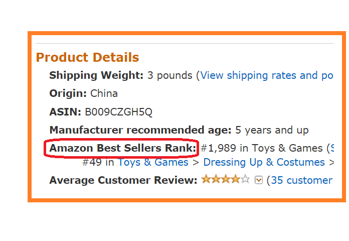
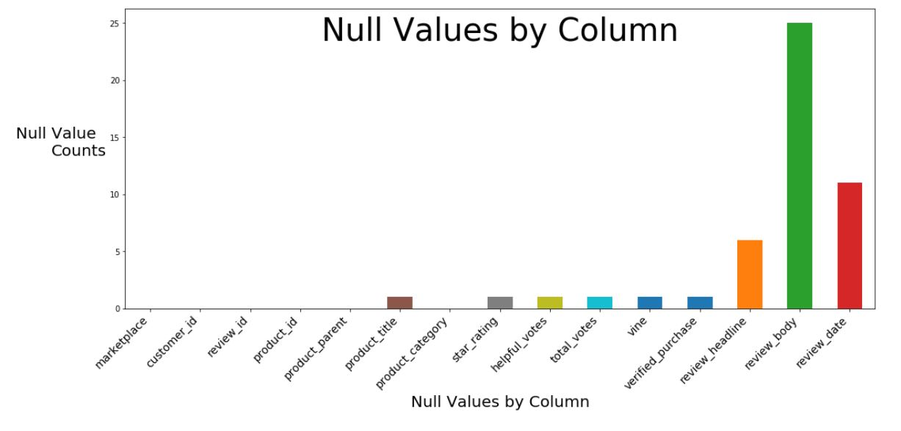
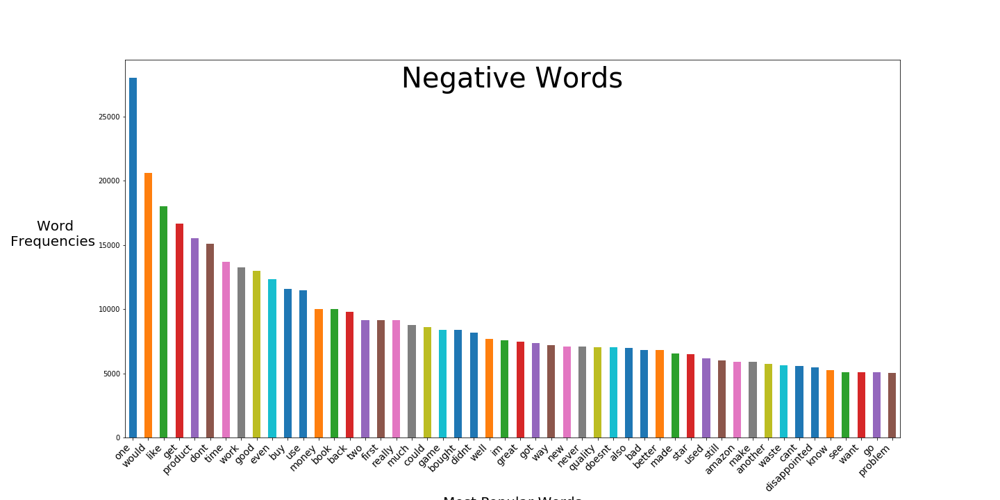
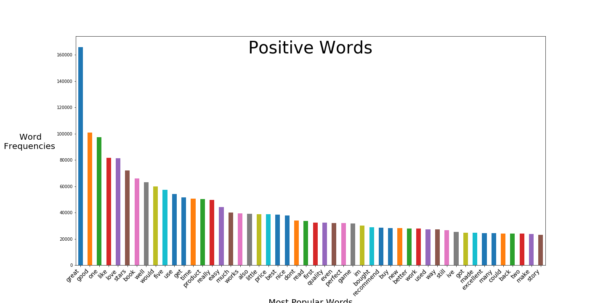

# Sentiment Analysis:  
Extracting Sentiment from Amazon Reviews

***


***

## Introduction

Customer reviews are extremely important these days.  A review on a product can not only drive the sale of the item, but positive and negative reviews can position your product higher or lower in the a customer's search.  This makes determining the sentiment of a review important as well as knowing which words drive that sentiment.  The goal here is to identify these words and help sellers to suggest keywords to influencers to use in reviews to maximize review effectiveness.

## The Problem

E-commerce sellers are constantly fighting for the top position in a search as well as the good reviews that give customers the confidence to purchase a product. Some sellers will even ask influencers to provide reviews in exchange for product discounts or even total purchase price reimbursement. This makes learning the key words that drive positive reviews very important. We aim to build a dashboard which will scrape Amazon in real time and provide those words within your chosen criteria.



## The Data 

#### The data for this project is from a data set curated by Amazon and can be found here:
https://s3.amazonaws.com/amazon-reviews-pds/readme.html

The dataset contains the customer review text with accompanying metadata :  
- A collection of reviews written in the Amazon.com marketplace and associated metadata from 1995 until 2015. This is intended to facilitate study into the properties (and the evolution) of customer reviews potentially including how people evaluate and express their experiences with respect to products at scale.


#### The data is offered as almost 50 zip files separated by category and contained a total of over 140 Million reviews.    
To get a more manageable size file to work with it was necessary to do the following:  
- Load each file and take a random sample of 100k reviews
- Concatenate the files together to form one working DataFrame
- Remove all 3 star reviews make for better training data
- Categorize the reviews as either:  
    - 4 star and 5 star as positive  
    - 1 star and 2 star as negative

# Preparing the data set  
The data obtained for this project was very clean and didn't require much in order to get it to a manageable state.  Following are a few of the actions that were taken to optimize the data for this problem.  

The process can be seen here: [Preparing the Data](./ETL%20-%20Building%20the%20Working%20Dataset.ipynb#Preparing_the_Data)


#### Classifying the reviews  
- First the reviews were visualized to understand their distribution
- Next all of the 3 star reviews were discarded for their ambiguity
- Finally the reviews were categorized as "Positive (1) and Negative (0) for classification purposes.  
    - 4's and 5's were converted to 1's
    - 1's and 2's were converted to 0's  
[Link to the Graph](./ETL%20-%20Building%20the%20Working%20Dataset.ipynb#star_ranking_graph)


#### Removing unnecessary data   
A few columns were not important to this study, so they were removed.  
-  _Marketplace_ - Identifies the country the purchase was made in.  All reviews in this set were from USA.
- _Review_id_ - A unique identifier
- _star_rating_ - The star rating given to the product. After classifying the reviews into positive and negative, this became redundant.
- _review_date_ - The date the review was made. This has no bearing on the sentiment of the review.
- _product_title_ - This is just the name of the product and serves no purpose in this analysis.  
  
There were also a few entries with Null values, and due to their small number, they were simply removed from the analysis.  
This process can be seen here: [Dropping the Null Values](./ETL%20-%20Building%20the%20Working%20Dataset.ipynb#dropping_nulls)



# Processing the Text  
The next step in the process was to tokenize the text using the tools available  in the NLTK Package. With these tools, new features were engineered for the analysis, the features are as follows:
- Tokenizing first by sentence then by words to create:
    - _tokenized_review_body_
    - _tokenized_review_headline_
    as seen here: [Tokenizing Process](./Pipeline.ipynb#tokenizing)
- Removing Stopwords which was amended to include extraneous values like "..." and random numbers to create the features:
    - _stopped_review_headline_  
    - _stopped_review_body_
    - The process can be seen here: [Removing Stopwords](./Pipeline.ipynb#stopwords)
- Next the data was processed to break it down into the words and their parts of speech, which yielded:
    - _body_pos_tagged_
    - _headline_pos_tagged_
    The proces can be seen here: [POS Tagging](./Pipeline.ipynb#pos_tags)

# Preparing for Analysis  
Now that the text was how we wanted it, we were ready to begin the analysis.  For this project we decided to use a process called TF-IDF or _Term Frequency Inverse Document Frequency_. This process reflects how important a word is in the document. This is done by multiplying two metrics: how many times a word appears in a document, and the inverse document frequency of the word across a set of documents.  
To prepare for this a few collections were made:  
- A set of [all words](./Pipeline.ipynb#all_words) (A sort of private dictionary or vocabulary for the documents)  
- A [Frequency distribution](./Pipeline.ipynb#freq_dist) (the number of times a word appears in the documents)  
- A [concatenation](./Pipeline.ipynb#cancatenation) of all reviews

# Visualizations
In order to get a better idea of the data, and to see if any further processing was necessary, the data was visualized in a few ways.

#### First a graph of the frequency of the most popular words was made from the Frequency Distribution.  
The graph can be found here: [Frequency Distribution Graph](./Pipeline.ipynb#freq_dist_graph)


#### Next a graph of the frequency of the most popular words from the negative reviews.  
The graph  can be found here: [Negative words Frequency Distribution Graph](./Pipeline.ipynb#neg_freq_dist) 



#### Next a graph of the frequency of the most popular words from the positive reviews.  
The graph  can be found here: [Positive words Frequency Distribution Graph](./Pipeline.ipynb#pos_freq_dist)



#### In order to get a better visualization of the words in each category, a WordCloud was created from each frequency distribution.  

All Words WordCloud
[Link to All Words WordCloud](./Pipeline.ipynb#all_words_cloud)


Negative Words WordCloud
[Link to Negative Words WordCloud](./Pipeline.ipynb#neg_words_cloud)


Positive Words WordCloud
[Link to Positive Words WordCloud](./Pipeline.ipynb#pos_words_cloud)


# Modeling  
Next, we began setting up the files for modeling by creating:  
- Train Test Split  
    - Splitting the data into 80% Training and 20% Testing
- Vectorizing the words using TF-IDF (Term Frequency Inverse Document Frequency)  
- A DataFrame for comparison of the model results

#### seven model combinations were attempted on this data and they are as follows:  
- MultiNomial Naive Bayes
    - Target - Review Body  
- RandomForest
    - Target - Review Body  
- LogisticRegression
    - Target - Review Body
    - Target - Review Headline
    - Target - Tokenized Headlines
- LinearSVC
    - Target - Tokenized Headlines


#### Below is a table of the accuracy scores for each model


# Conclusion
- Much of the sentiment seems to be captured by the headlines
- NaiveBayes and Random Forest were not very effective on this dataset
- LinearRegresion with the review body was just slightly better than on the headline
- Linear SVC seems to have better captured the sentiment of the review body  

Being able to understand the sentiment of the reviews and the words associated with both positive and negative reviews is important to Amazon sellers and can be useful in many ways.
- Using positive words in post sale communication to encourage certain words to be included in reviews may help move a product up in the search results.
- Identifying negative words to discover if a false positive review was made

# Continuing Work
#### Non_compliant dataset:  
    - There is a complementary data set which contains reviews which were tagged by Amazon as non-compliant. 
    - This dataset could help to improve the model by training on the characteristics of the non-compliant reviews.  
#### Train on a larger set of the data:
    - This dataset is huge and spans over almost 2 decades. A larger sample of a more focused time period may yield better results  
#### Separate by Category:
    - Each category may have it's own characteristics that drive the sentiment  
#### Assign more weight to reviews contributed by Vine members:
    - Vine members are super reviewers who have been identified by Amazon as reliable and un-biased


```python

```
